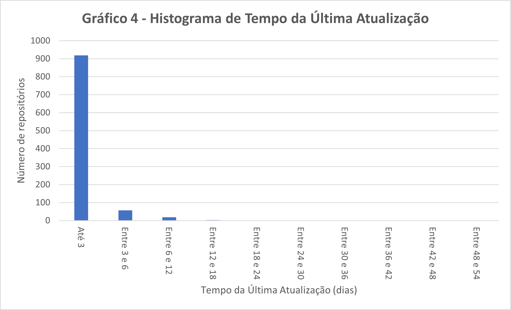
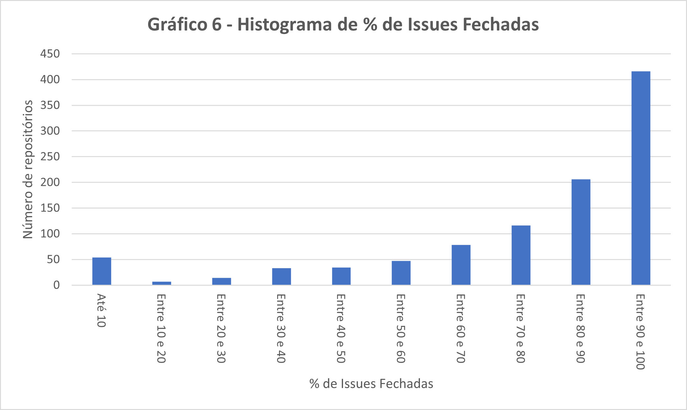
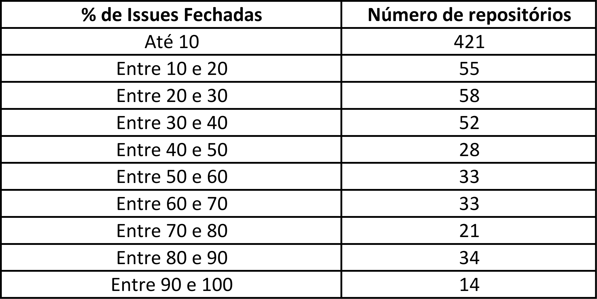

# Relatório 01 - Laboratório de Experimentação de Software

**Guilherme Luiz Carvalho Pinto**

**Pedro Vítor Felix da Costa**

---

_Curso de Engenharia de Software, Unidade Praça da Liberdade_

_Instituto de Informática e Ciências Exatas – Pontifícia Universidade de Minas Gerais (PUC MINAS), Belo Horizonte – MG – Brasil_

---
 

# 1. Introdução

Os repositórios populares do GitHub possuem os mais diversos conteúdos e comportamentos. Para entedê-los é necessário analisar a atividade deles para compreender o que faz com que tantas pessoas interajam com esses repositórios, sendo assim necessário avaliar fatores que caracterizam a atividades desses projetos. Esse relatório visa analisar características dos 1000 repositórios com mais estrelas do GitHub.

# 2. Hipóteses

**RQ 01. Sistemas populares são maduros/antigos?**

Considerando que um sistema antigo tenha 5 anos ou mais, pode se considerar que um sistema popular é antigo, pois até o repositório alcançar notoriedade e atingir uma quantidade razoável de forks e favoritos ele deve ser divulgado e é necessário que o código se torne relevante para comunidade.

**RQ 02. Sistemas populares recebem muita contribuição externa?**

O fato dos repositórios populares terem grande visibilidade faz com que ele tenha muitas contribuições externas se comparado a repositórios não populares, desconsiderando os repositórios de cursos e conteúdo de aprendizado. A colaboração pode não ser tão relevante se comparada a colaboração dos criadores do repositório, mas a quantidade é muito maior se comparados a sistemas com baixa popularidade.

**RQ 03. Sistemas populares lançam releases com frequência?**
	
Considerando que os sistemas populares utilizam o SCRUM como metodologia de desenvolvimento e essa metodologia prega a entrega contínua de produto, pode se dizer que esses sistemas lançam releases frequentemente.

**RQ 04. Sistemas populares são atualizados com frequência?**
	
O fato de ser atualizado com frequência é uma junção dos fatores citados acima. Além de receber muitas colaborações externas, os repositórios por usarem o SCRUM realizam entregas frequentes, gerando atualização frequente do sistema.

**RQ 05. Sistemas populares são escritos nas linguagens mais populares?**
	
Sendo as linguagens populares de maior interesse dos desenvolvedores, os sistemas populares têm maior probabilidade de adquirir notoriedade se desenvolvidos nessas linguagens, então pode se dizer que sim.

**RQ 06. Sistemas populares possuem um alto percentual de issues fechadas?**
	
Como mencionado anteriormente, sistemas populares em sua maioria possuem cinco anos ou mais e provavelmente possuem versões estáveis atualmente, possuindo poucas melhorias ou adição de funcionalidade se comparado ao que já foi feito anteriormente. Sendo assim, sistemas populares possuem alto percentual de issues fechadas.

# 3. Metodologia
A fim de buscar informações sobre os repositórios, utilizou-se a API fornecida pelo GitHub. Para isso, foi construído um script em pyhton - ver queryGraphQL.py - realizando do consulta dos seguintes parâmetros:

- Total de pull requests;
- Total de releases;
- Linguagem principal do repositório;
- Total de issues;
- Total de issues fechadas;
- Data de criação do repositório;
- Data da última atualização do repositório.

O script realiza consultas na API do GitHub, utilizando a paginação, com o intuito de recuperar os 1000 registros. A paginação é necessária devido a limitação do tamanho de retorno.

Utilizando os dados retornados, são calculadas algumas métricas necessárias para investigar as hipotéses descritas na seção 2. As métricas calculadas são:

- Idade do repositório em anos: subtração da data de execução do script e a data de criação do repositório;
- Idade do repositório em meses: cálculo similar ao da idade do repositório, porém exibindo o valor em meses;
- Média de releses por mês: quantidade total de releases dividida pela idade em meses;
- Quantidade de dias da última atualização: subtração da data de execução pela data da última atualização.

Ao final da execução do script, é salvo um csv com os dados do projeto e são plotados gráficos para análise dos dados.

# 4. Resultados

Após a coleta dos dados pela API do GitHub obtem-se:

## **4.1. RQ 01**

690 repositórios populares possuem idade maior que 5 anos, essa parcela representa 69% do total. Os repositórios possuem em média 7 anos e mediana das idades é também 7 anos, indicando que a maior densidade das idades se encontra por volta desse valor - ver Figura 1.

**Figura 1 - Histograma de Idade dos Repositórios**

**Tabela 1 - Histograma de Idade dos Repositórios**
  

## **4.2. RQ 02**

Em relação as contribuições externas, 949 repositórios possuem até 15 mil pull requests, vide Figura 2 e Tabela 2. A mediana dos valores é de 811 pull requests, indicando que 50% dos repositórios tem 811 ou menos contribuições externas aceitas e corroborando com a distribuição do histograma abaixo. A média é de 3569 pull requests por repositório.

**Figura 2 - Histograma de Pull Requests**

**Tabela 2 - Tabela de Pull Requests**
  

## **4.3. RQ 03**

Analisando a Tabela 3, é possível perceber que 976 repositórios tem a média de 6 releases por mês, porém a mediana dos valores é de 0,2249, indicando que 50% dos valores são iguais ou menores do que 0,2249. A média se encontra de certa forma próxima a esse valor, sendo 1,0274 releases/mês/repositório, o que mostra que poucos outros repositórios extrapolam o valor da mediana.

**Figura 3 - Histograma de Média de Releases Por Mês**

**Tabela 3 - Tabela de Média de Releases Por Mês**
  

## **4.4. RQ 04**

Observa-se no Gráfico 4 que grande parte dos repositórios tem até 3 dias da última atualização. Detalhando os valores obtidos, obtem-se a média de 2,4121 dias de tempo atualização e uma mediana de 1,2187, indicando que aproximadamente 50% dos repositórios tiverem atualização no dia anterior.

**Figura 4 - Histograma de Tempo da Última Atualização**

**Tabela 4 - Tabela de Tempo da Última Atualização**
  

## **4.5. RQ 05**

A tabela abaixo mostra as 10 linguagens mais populares de 2022 e quantos repositórios da coleta utilizam elas como linguagem principal. No total, 652 repositórios se encaixam, representando 65,2% de todos os repositórios coletados.

**Tabela 5 - Tabela de Repositórios por Linguagens**
  

## **4.6. RQ 06**

Observa-se na Figura 6 e na Tabela 6 que grande parte dos repositórios possuem mais de 50% de issues fechadas. A mediana desses valores é de 85,99%, indicando que 50% dos repositórios possuem quase a totatalidade de issues como issues fechadas. A média das porcentagens é de 76,78%, corroborando com a concentração mostrada no gráfico.

**Figura 6 - Histograma de % de Issues Fechadas**

**Tabela 6 - Tabela de % de Issues Fechadas**

# 5. Discussão

A partir dos resultados obtidos, pode-se realizar um comparativo entre eles e as hipóteses propostas.

**RQ 01. Sistemas populares são maduros/antigos?**

A apresentação dos resultados demonstra a concentração de repositórios com idade entre 5 à 9 anos, sendo minoria tanto os repositórios recentes quantos os mais antigos à esse período. Nesse sentido, os mesmos confirmam a hipótese levantada, quando considerado repositórios maduros como aqueles com mais de 5 anos, pois os sistemas populares possuem em sua maioria entre 5 à 9 anos, incluindo também aqueles que possuem mais que 9 anos de idade.  

**RQ 02. Sistemas populares recebem muita contribuição externa?**

Os resultados obtidos indicam que grande parcela dos repositórios populares não recebem mais que 15000 contribuições externas, sendo essa representada por 949 dos 1000 repositórios coletados. Dessa forma, os mesmos são contrários à hipótese proposta, pois o esperado seria que grande parcela dos repositórios populares possuíse muita contribuição externa, porém o resultado obtido demonstra que o número de contribuições externas não varia muito entre boa parte dos repositórios, entretanto existem poucos repositórios que possuem um número maior de contribuições.

**RQ 03. Sistemas populares lançam releases com frequência?**
	
Segundo os resultados, os repositórios populares possuem em média 6 releases por mês, sendo poucos os que possuem mais de 6 releases por mês. Assim, conclui-se que está em concordância com a hipótese proposta, pois como a mesma baseia-se no uso de metodologias ágeis, em específico SCRUM, o qual não estabelece tempo mínimo de sprint, pode-se observar que a quantidade de releases em 30 dias respeitaria o princípio de entrega continua do framework. Além disso, a frequência de 6 releases no período de 30 dias contabiliza 1 release a cada 5 dias, o que pode ser considerado uma frequência adequada.

**RQ 04. Sistemas populares são atualizados com frequência?**

De acordo com os resultados obtidos, a maior parte dos repositórios são atualizados na frequência de 3 dias, podendo concluir que os sistemas populares são frequentemente atualizados, pois 3 dias não representam ameaça ao estado de funcionamento do sistema.

**RQ 05. Sistemas populares são escritos nas linguagens mais populares?**
	
Os resultados obtidos constataram que as linguagens principais utilizadas em mais de 100 repositórios populares são JavaScript, Python e TypeScript, o que não confirma totalmente a hipótese proposta, pois conforme os dados levantados pelo GitHub, em 2022 as 3 linguagens mais utilizadas foram JavaScript, Python e Java, deixando a parte TypeScript o qual se encontra na posição de 4° linguagem mais utilizada pelos desenvolvedores. Em vista disso, esse comportamento pode-se advir de vários fatores incluindo o fato de que foi constatado que os repositórios populares possuem em sua maioria 5 à 9 anos de idade, enquanto isso a linguagem TypeScript se qualificou como uma das 10 linguagens mais utilizadas apenas a partir de 2017. Ou seja, é possível que boa parte dos sistemas populares foram criados em um momento que Java possuía popularidade maior à de TypeScript. 

**RQ 06. Sistemas populares possuem um alto percentual de issues fechadas?**
	
Os resultados obtidos indicam que metade dos repositórios possuem quase todas as issues existentes como fechadas. Dessa forma, os resultados reafirmam a hipótese proposta, devido ao fato de que considerando a idade dos repositórios, em sua maioria estão em fases estáveis de desenvolvimento sendo fácil de solucionar as issues abertas quando comparado ao progresso realizado anteriormente no desenvolvimento do sistema.  

